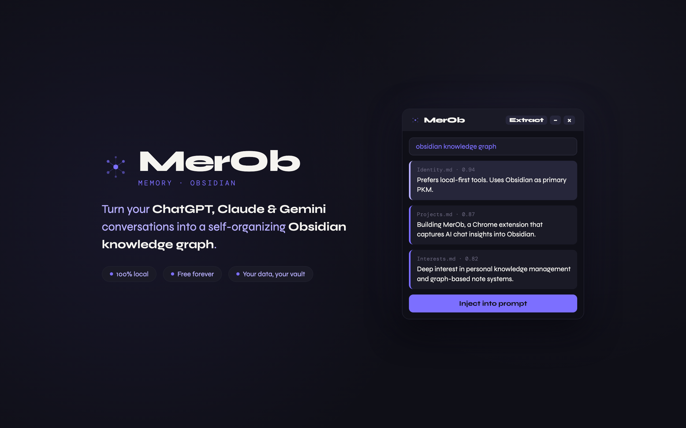
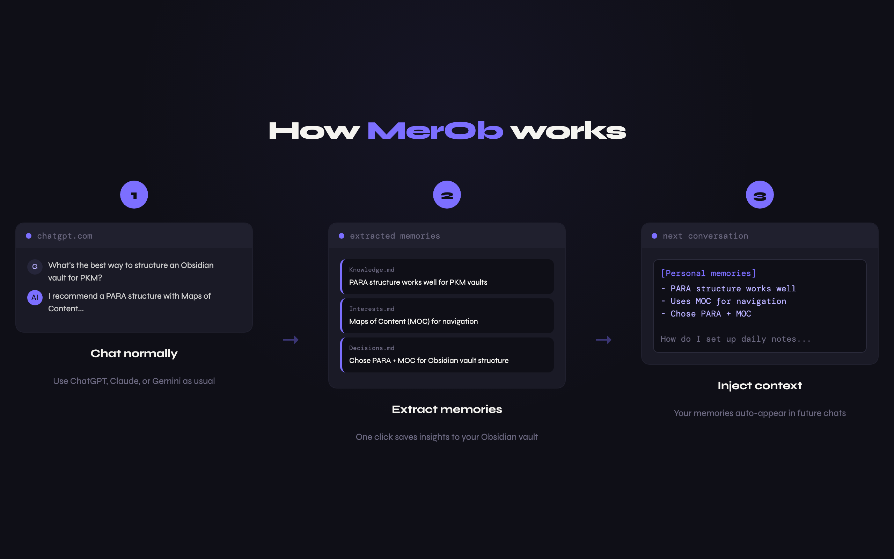
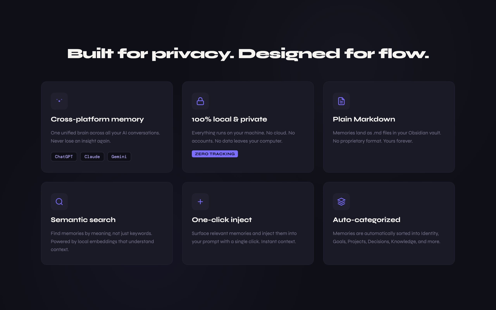

<div align="center">

# MerOb — Memory · Obsidian

**Turn your ChatGPT, Claude & Gemini conversations into a self-organizing knowledge graph.**

[Install](#-install) · [How it works](#-how-it-works) · [Features](#-features) · [Roadmap](#-roadmap)

</div>

---



Your best thinking happens inside AI chats — and then dies in a history you'll never reopen.

**MerOb** captures the insights from your conversations and files them into your own **Obsidian vault** as individual, linked notes. Over time, a knowledge graph grows itself.

### Why MerOb?

- 🧠 **One brain across ChatGPT, Claude & Gemini** — unified memory from all three platforms
- 📂 **Your vault, your data** — plain Markdown files you own forever. Not a cloud silo.
- 🔒 **100% local & private** — no servers, no telemetry, no vendor lock-in
- 🕸️ **Knowledge graph, not a list** — memories auto-link and organize themselves
- ↩️ **Memories inject into prompts** — relevant notes surface as you type

## 🚀 How MerOb Works



1. **Chat normally** — Use ChatGPT, Claude, or Gemini as usual
2. **Extract memories** — One click saves insights to your vault  
3. **Inject context** — Memories surface in future conversations automatically

---

## ✨ Features



### Built for privacy. Designed for flow.

- **Cross-platform memory** — Unified store across ChatGPT, Claude, and Gemini
- **100% local & private** — Everything stays on your machine
- **Plain Markdown** — Memories stored as `.md` files in your Obsidian vault
- **Semantic search** — Find memories by meaning, not keywords
- **One-click inject** — Insert memories into future prompts instantly
- **Auto-categorized** — Memories sorted by topic, automatically discovered

---

## 📦 Install

Full step-by-step guide in **[INSTALL.md](INSTALL.md)**. Quick start:

```bash
git clone https://github.com/<username>/merob.git
cd merob

# macOS / Linux
./start.sh

# Windows
start.bat
```

Then load the `chrome_extension/` folder in `chrome://extensions` (Developer mode → *Load unpacked*).

**Requirements:** Python 3.10+, Obsidian, Chrome/Edge/Brave

---

## 🛡️ Privacy by Design

| Feature | Built-in Memory | Cloud SaaS | **MerOb** |
| --- | :---: | :---: | :---: |
| Cross-platform (GPT + Claude + Gemini) | ❌ | ⚠️ | ✅ |
| Your data in Markdown | ❌ | ❌ | ✅ |
| 100% local & free | ❌ | ❌ | ✅ |
| Knowledge graph | ❌ | ⚠️ | ✅ |

---

## 🗺️ Roadmap

- [x] Extract & organize memories with one click
- [x] Semantic search across your vault
- [x] Auto-link and categorize notes
- [x] Inject memories into conversations
- [ ] Native Obsidian plugin (no server setup)
- [ ] Mobile app (iOS / Android)
- [ ] Multi-browser support (Firefox, Safari)

---

## 🤝 Contributing

Found a bug? Have an idea? Contributions welcome!

- 🐛 [Report bugs](../../issues)
- 💡 [Request features](../../discussions)
- 🔧 [Submit PRs](#)

**If this tool resonates, a ⭐ helps others find it.**

---

## 📄 License

MIT — see [LICENSE](LICENSE)

---

<div align="center">

**Made with ❤️ for curious minds**

*Transform conversations into wisdom. One extraction at a time.*

</div>
